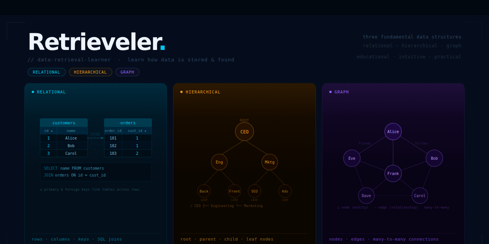

# Retrieveler

Retrieveler means "data retrieval learner." The project is designed to teach data retrieval using three fundamental data structures, each organized to suit a particular type of information.

🌐 **Live site:** [thepragmaticway.github.io/retrieveler](https://thepragmaticway.github.io/retrieveler)

## What is Retrieveler?

Retrieveler is an intuitive learning project focused on understanding how data is stored and retrieved in different structures:

- Relational Data Structure
- Hierarchical Data Structure
- Graph Data Structure

The goal is to explore the nature of each structure and see concrete examples of how real-world data fits naturally into each form.

## Data Structure Types

### Relational Data Structure

Nature:

- Data is organized in tables with rows and columns.
- Records are related through keys.
- Best for structured records and transactions.

Concrete examples:

- A customer database with tables for `Customers`, `Orders`, and `Products`.
- Each `Order` row links to a `Customer` and one or more `Product` rows.
- SQL queries retrieve related rows across tables with `JOIN`.

When to use it:

- Business applications, finance systems, inventory management, and any data with well-defined schema.

### Hierarchical Data Structure

Nature:

- Data is organized as nested parent-child relationships through a DOM-like tree.
- Retrieval uses relationships: descendant chains, direct child selection, and sibling navigation.
- Selectors can also filter by class, ID, attributes, position, and state for precise targeting.
- Best for document-like data, user interface hierarchies, and tree-structured content.

Concrete examples from the CSS Selector Learner:

- **Basic selectors**: Match all elements of a type or class (e.g., all `article` elements or `.sample-card` containers).
- **Relationship selectors**: Navigate the tree using descendant chains (`section article`), direct children (`.sample-card > h4`), and siblings (`h4 + p`, `h4 ~ p`).
- **Identity and class selectors**: Target specific named elements by ID (`#feedbackForm`) or class group (`.badge`, `.metric`).
- **Attribute selectors**: Filter by metadata like `data-*` attributes, type attributes, and presence checks (`[data-panel]`, `input[type="checkbox"]`, `[disabled]`).
- **Structural selectors**: Select by position (`:first-child`, `:nth-child(2)`, `:last-child`) and conditions (`:not([open])`, `:has(time)`).
- **State selectors**: Match UI states like `:checked`, `:disabled`, and `:enabled` for dynamic content.

When to use it:

- HTML/DOM structures, XML/JSON documents, file systems, and any nested data requiring path-based or relationship-based retrieval.

### Graph Data Structure

Nature:

- Data is organized as nodes and edges.
- Relationships are first-class objects and can be many-to-many.
- Best for complex, interconnected data.

Concrete examples:

- Social networks, where users are nodes and friendships are edges.
- Recommendation systems, where users, items, and behaviors connect in a network.
- Knowledge graphs, where concepts link to related concepts.

When to use it:

- Networks, connected data, recommendations, route planning, and relationship-heavy domains.

## Data Security

Effective data management goes beyond retrieval—it requires secure handling at every stage:

### Data Storage Security
- Protecting data at rest using encryption and secure file permissions
- Ensuring only authorized parties can access stored information
- Examples: encrypted databases, secure backups, access control lists

### Data Transfer Security
- Protecting data in transit using encryption protocols
- Preventing interception and unauthorized access during transmission
- Examples: HTTPS/TLS, VPN tunnels, secure APIs

### Data Retrieval Security
- Ensuring only authorized users can retrieve specific data
- Implementing authentication and fine-grained access controls
- Auditing and logging retrieval activities
- Examples: role-based access control, query logging, secure APIs

Understanding these security principles is essential for building trustworthy systems that safely manage sensitive information.

## Learning Approach

Retrieveler aims to make these concepts easy to grasp by showing how each one fits different data types and retrieval patterns. The project emphasizes:

- recognizing which structure matches a given dataset
- comparing how retrieval works in each model
- understanding security at every stage of data lifecycle
- practicing with concrete examples and intuitive visuals

## CSS Selector Learner

The CSS Selector Learner page is a hands-on session for understanding hierarchical data retrieval in the context of HTML.

What it is:

- an interactive example of a DOM-like tree structure
- a practice page for selecting nested elements by tag, class, id, and structural relationships
- a bridge between hierarchical data theory and real-world web development

How to use it:

- start by examining the page structure and the nested HTML elements
- try choosing selectors that match children, descendants, siblings, and specific attributes
- compare how different selectors return different elements in the hierarchy

Learners can use this page to see how data retrieval works when the data is organized as a tree. It shows:

- how nested elements form a hierarchical data structure
- how CSS selectors can be used to retrieve specific nodes
- how structural relationships like parent/child and ancestor/descendant affect retrieval results

This session is designed to make hierarchical structure intuitive by letting learners explore and practice on a real HTML document model.

## Object Lab

The Object Lab is a live DOM inspector that helps learners explore how nested HTML structures map to object properties, methods, and event hooks.

What it is:

- a query builder for `querySelectorAll` and `querySelector` against a sample DOM
- a rendered stage with cards like "Modern interface review", a feedback form, and quick notes
- an inspector pane that shows matched elements, attributes, properties, methods, and events
- an executor area where learners can turn selected elements into code cells for deeper inspection

How to use it:

- enter selectors and choose whether to inspect one element or all matching elements
- watch matched DOM nodes highlight in the sample stage and update match counts instantly
- inspect form controls, details panels, buttons, and nested sections to see how objects expose properties and relationships
- use the inspector tabs to examine attributes, methods like `querySelector`, and event handling support

This session makes it concrete how hierarchical HTML content becomes a navigable object graph in the browser.

## Regex Lab

The Regex Lab teaches text retrieval through a structured, interactive exploration of regular expressions.

What it is:

- a mental model that treats text as a nested hierarchy of document → paragraph → sentence → word → character
- a comparison of standard string functions versus reusable regex templates
- a category-driven guide for characters, quantity, grouping, and positional anchors
- a live editing lab with quick presets for numbers, words, dates, lines, and sentences

How to use it:

- start from the mental model and see how regex describes text structure rather than fixed text
- practice with exact string search examples, then generalize with regex patterns like `\d+`, `\b\w+\b`, and `\d{4}-\d{2}-\d{2}`
- use the live lab to edit patterns and see matching text highlight in real time
- explore challenges and the built-in cheatsheet to build confidence with regex building blocks

This session shows how pattern-based retrieval can extract structured information from unstructured text with immediate feedback.

## Crypto Lab

The Crypto Lab walks learners through practical cryptographic building blocks and an interactive browser-based security workflow.

What it is:

- a tabbed lab covering XOR cipher, one-way functions, modulo/trapdoor behavior, hash functions, and the Web Crypto API
- a playground for XOR encryption/decryption with bit-level breakdowns
- demonstrations of why one-way functions and modulo arithmetic are useful for secure storage
- a hand-built hash demo showing determinism, fixed output size, and avalanche behavior
- a Web Crypto API simulation for SHA-256 hashing, salted password storage, registration, and login verification

How to use it:

- experiment with message/key pairs in the XOR tab and watch same-key encryption/decryption restore the text
- explore one-way functions and modulo collisions to see why some operations are hard to reverse
- type text into the hash playground and observe how tiny input changes produce dramatically different hashes
- use the Web Crypto tab to simulate salt generation, password hashing, and secure credential verification without storing plain-text passwords
- examine which values are stored (salt, hash, username) and which are intentionally never persisted (raw password)

This session reinforces that secure data retrieval depends on strong encryption, one-way storage, and careful transfer and verification practices.

## IPC Lab

The [IPC Lab](./ipc-lab.html) teaches interprocess communication from operating-system fundamentals through practical networking workflows.

What it is:

- a guided module on how operating systems manage process-to-resource and process-to-process communication
- a comparison of IPC mechanisms including pipes, named pipes, shared memory, message queues, and sockets
- an explanation of TCP as a reliable ordered stream and HTTP as a message protocol layered on top of TCP
- hands-on command-line labs using tools like `ncat`, `curl`, `wget`, and HTTP clients to inspect real communication flows

How to use it:

- start with the OS platform model to understand why IPC exists
- compare local IPC mechanisms before moving into TCP and HTTP
- run the pipe and socket examples to see how data moves between processes
- inspect HTTP requests and responses to connect application-level messages back to the transport layer

This session shows how retrieval and communication depend on the operating system and network protocols that move data between programs.

## Why this project matters

Understanding these three data structures is essential for anyone working with data retrieval, because each structure shapes how data is stored, searched, and joined.

Retrieveler is intended as a learning companion for developers, students, and anyone who wants to understand data retrieval patterns clearly and intuitively.
